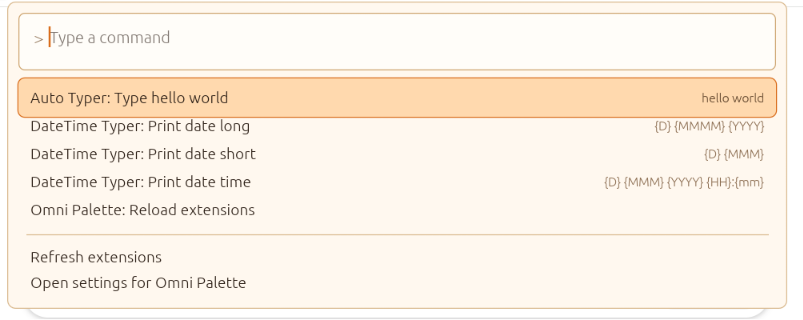
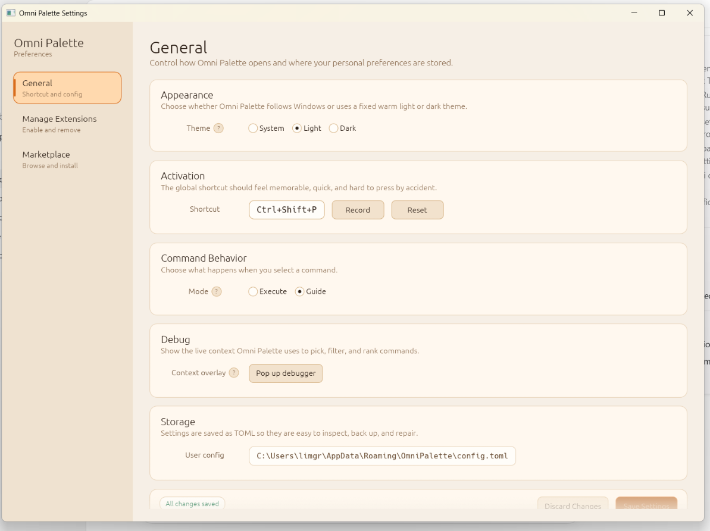
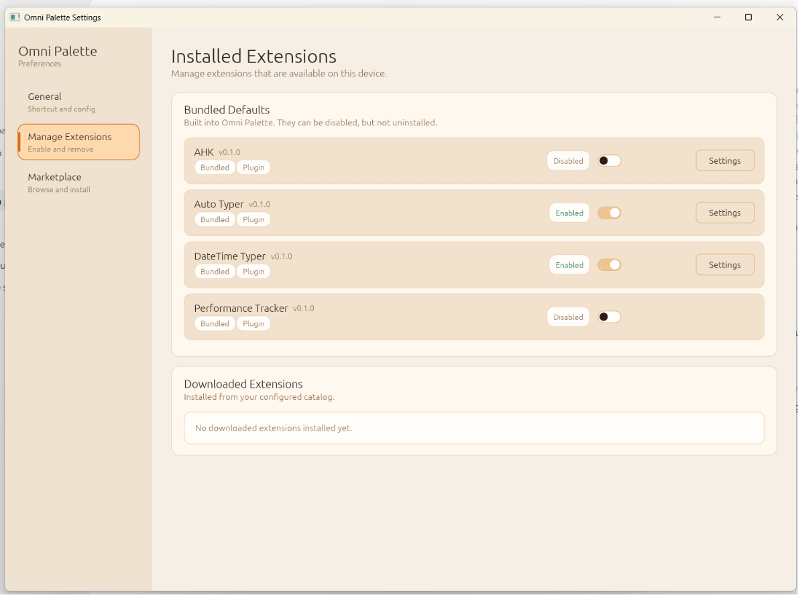
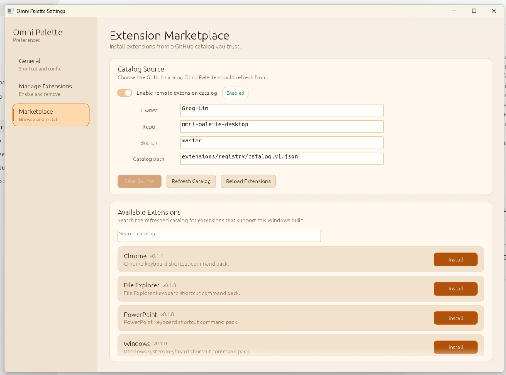

# Migration Reference Assets

This folder holds visual references for the egui-to-Tauri migration.

Reference screenshot files:

- `egui-palette-reference.png`
- `egui-settings-general-reference.png`
- `egui-settings-installed-extensions-reference.png`
- `egui-settings-marketplace-reference.png`

These screenshots are the egui baseline for feature parity. Styling does not
need to be copied exactly during early Tauri phases, but missing controls,
surfaces, fixed actions, and page structure should be tracked in the canonical
migration plan.

## Preview

### Palette

### Settings: General

### Settings: Installed Extensions

### Settings: Marketplace

